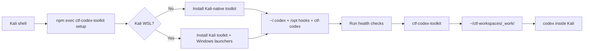

# CTF Codex Toolkit

[](https://www.npmjs.com/package/ctf-codex-toolkit)
[](https://github.com/nimosocute/ctf-codex-toolkit/actions/workflows/ci.yml)
[](LICENSE)
[](package.json)

CTF-focused Codex setup for Kali Linux and Kali WSL.

`ctf-codex-toolkit` is installed from a Kali shell, either on native Kali or inside Kali WSL. The installer auto-detects the environment:

- Kali native: installs the Linux-side Codex CTF toolkit only.
- Kali WSL: installs the same Kali-side toolkit and also restores the Windows launcher/shortcut workflow.

It installs the managed Codex CTF environment into Kali: skills, checklists, snippets, guard hooks, health checks, optional browser automation helpers, and per-challenge launchers.

The intended workflow is:

```text
Kali shell
  -> npm exec --yes --package ctf-codex-toolkit -- ctf-codex-toolkit setup
  -> auto-detect Kali native vs Kali WSL
  -> ~/.codex CTF payload
  -> /opt/codex-ctf-hooks guard hooks
  -> WSL only: Windows launcher + Desktop shortcut
  -> ctf-codex-toolkit <challenge>
  -> ~/ctf-workspaces/_work/<challenge>
  -> codex inside Kali
```

## Table of Contents

- [What This Project Provides](#what-this-project-provides)
- [Install](#install)
- [Requirements](#requirements)
- [How It Works](#how-it-works)
- [Command Reference](#command-reference)
- [Installed Files](#installed-files)
- [Workspace Model](#workspace-model)
- [Skill Credits and Updates](#skill-credits-and-updates)
- [Browser Arm](#browser-arm)
- [Health Checks](#health-checks)
- [Safety Model](#safety-model)
- [Supply Chain Notes](#supply-chain-notes)
- [Contributing](#contributing)
- [License](#license)

## What This Project Provides

This repository packages the operational pieces needed to run Codex as a CTF assistant inside Kali.

| Area | Included |
| --- | --- |
| Codex CTF policy | Managed `AGENTS.md`, category routing, workflow guidance |
| Skills | Web, pwn, crypto, reverse, forensics, OSINT, malware, AI/ML, misc, solve dispatcher, writeup |
| Guard hooks | Pre-tool checks for broad scans, high-risk commands, and oversized candidate loops |
| Health checks | One-shot environment inventory for CTF tools, providers, Browser Arm, hooks |
| Browser support | Optional isolated Browser Arm venv using pinned `cloakbrowser==0.3.31` |
| Launchers | `ctf-codex-toolkit <challenge>` and `/usr/local/bin/ctf-codex <challenge>` |
| WSL integration | When run inside Kali WSL, writes the Windows `.ps1`/`.cmd` launcher and Desktop shortcut |
| Workspace layout | Per-challenge directories under a user-selected CTF root |

The package intentionally does not ship Codex provider configuration. Users keep their own official OpenAI Codex config or compatible third-party config outside this repository.

## Install

All commands below run inside Kali Linux or Kali WSL.

Install prerequisites if they are missing:

```bash
sudo apt update
sudo apt install -y nodejs npm python3 python3-venv git sudo
```

Verify Codex CLI is available inside Kali:

```bash
codex --version
```

Run setup:

```bash
npm exec --yes --package ctf-codex-toolkit -- ctf-codex-toolkit setup
```

For a pinned install:

```bash
npm exec --yes --package ctf-codex-toolkit@0.1.2 -- ctf-codex-toolkit setup
```

Or install the CLI globally inside Kali:

```bash
npm install -g ctf-codex-toolkit
ctf-codex-toolkit setup
```

Start a challenge session:

```bash
ctf-codex-toolkit my_challenge
```

Resume the last session for a challenge:

```bash
ctf-codex-toolkit my_challenge -Resume
```

Install directly from GitHub when testing unreleased changes:

```bash
npm exec --yes --package github:nimosocute/ctf-codex-toolkit -- ctf-codex-toolkit setup
```

## Requirements

- Kali Linux or Kali WSL
- Node.js/npm inside Kali
- Python 3 and `python3-venv`
- Git
- `sudo` for installing `/opt/codex-ctf-hooks/*` and `/usr/local/bin/ctf-codex`
- Codex CLI installed inside Kali and available as `codex`

This package does not install Kali Linux, WSL, or Codex CLI. It configures an existing Kali environment for CTF-focused Codex workflows.

When setup is run inside Kali WSL and Windows interop is available, it also writes:

```text
%USERPROFILE%\ctf-codex-wsl.ps1
%USERPROFILE%\ctf-codex-wsl.cmd
Desktop\CTF Codex WSL.lnk
```

Kali native installs skip those Windows files automatically.

Use a non-default CTF root:

```bash
ctf-codex-toolkit setup --ctf-root ~/ctf
ctf-codex-toolkit my_challenge --ctf-root ~/ctf
```

During `setup` or `install`, the CLI asks where to place the CTF workspace root and stores the answer in:

```text
~/.ctf-codex-toolkit.json
```

Press Enter to use:

```text
~/ctf-workspaces
```

The launcher also honors:

- `CTF_CODEX_ROOT`
- `CTF_ROOT`
- `CODEX_BIN`

Explicit CLI flags take precedence over environment variables and saved config.

## How It Works



Setup performs three jobs:

1. Copy the managed payload into `~/.codex`.
2. Install guard hooks and the `ctf-codex` launcher locally in Kali.
3. Prepare optional helper environments, including Browser Arm unless skipped.
4. In Kali WSL only, install the Windows launcher files and Desktop shortcut.

After setup, challenge sessions run under:

```text
<ctf-root>/_work/<challenge>
```

## Command Reference

```text
ctf-codex-toolkit setup [--ctf-root <path>] [--no-browser-arm] [--skip-health]
ctf-codex-toolkit install [--ctf-root <path>] [--no-browser-arm]
ctf-codex-toolkit health
ctf-codex-toolkit update-skills [--source https://github.com/ljagiello/ctf-skills.git]
ctf-codex-toolkit install-launchers
ctf-codex-toolkit <challenge> [-Resume] [--ctf-root <path>]
ctf-codex <challenge> [-Resume] [--ctf-root <path>]
```

Compatibility aliases:

```text
ctf-codex-workflow
ctf-codex-wsl
ctf-codex
```

`setup` is the usual entry point. It runs `install` and then `health`.

Use `--skip-health` when optional tools are not installed yet:

```bash
ctf-codex-toolkit setup --skip-health
```

Use `--no-browser-arm` to skip Browser Arm entirely:

```bash
ctf-codex-toolkit setup --no-browser-arm
```

Use `install-launchers` inside Kali WSL to recreate only the Windows launcher files and Desktop shortcut:

```bash
ctf-codex-toolkit install-launchers
```

## Installed Files

Inside Kali, `install` writes:

```text
~/.codex/AGENTS.md
~/.codex/ctf-checklists.md
~/.codex/ctf-snippets/
~/.codex/skills/ctf-*
~/.codex/skills/solve-challenge
~/.codex/skills/ctf-writeup
~/.codex/tools/ctf_health_check.py
~/.codex/tools/browser_arm/browser_server.py
~/.codex/tools/browser_arm/browser_client.py
~/.ctf-codex-toolkit.json
/opt/codex-ctf-hooks/*
/usr/local/bin/ctf-codex
```

Inside Kali WSL only, setup also writes Windows-side launcher files through Windows interop:

```text
%USERPROFILE%\ctf-codex-wsl.ps1
%USERPROFILE%\ctf-codex-wsl.cmd
Desktop\CTF Codex WSL.lnk
```

The installer does not copy:

- `~/.codex/config.toml`
- provider keys
- API tokens
- sessions
- logs
- cookies
- `.env` files
- private keys
- runtime SQLite state

## Workspace Model

The CTF root is selected during setup. A challenge named `web_login` creates or uses:

```text
~/ctf-workspaces/_work/web_login
```

That directory becomes the working directory for Codex.

Example:

```bash
ctf-codex-toolkit web_login
ctf-codex-toolkit web_login -Resume
```

## Skill Credits and Updates

The bundled CTF skill directories are derived from [ljagiello/ctf-skills](https://github.com/ljagiello/ctf-skills.git). Credit for the upstream CTF skill content belongs to that project and its contributors.

This toolkit packages those skills with Kali launchers, guard hooks, health checks, snippets, and CTF workflow files.

Automatic update from upstream:

```bash
ctf-codex-toolkit update-skills
```

Automatic update from a fork or compatible repository:

```bash
ctf-codex-toolkit update-skills --source https://github.com/<owner>/<repo>.git
```

The updater runs inside Kali, clones the source repository, finds skill directories containing `SKILL.md`, and refreshes matching CTF skill directories under:

```text
~/.codex/skills/
```

It updates directories named `ctf-*`, `solve-challenge`, and `ctf-writeup`. It does not delete unrelated user skills.

Manual update inside Kali:

```bash
tmp="$(mktemp -d)"
git clone --depth 1 https://github.com/ljagiello/ctf-skills.git "$tmp/ctf-skills"
mkdir -p ~/.codex/skills
find "$tmp/ctf-skills" -mindepth 1 -maxdepth 3 -name SKILL.md -type f -print |
while read -r skill_file; do
  skill_dir="$(dirname "$skill_file")"
  name="$(basename "$skill_dir")"
  case "$name" in
    ctf-*|solve-challenge|ctf-writeup)
      rm -rf "$HOME/.codex/skills/$name"
      cp -a "$skill_dir" "$HOME/.codex/skills/$name"
      ;;
  esac
done
rm -rf "$tmp"
```

See [THIRD_PARTY_NOTICES.md](THIRD_PARTY_NOTICES.md).

## Browser Arm

By default, `setup` and `install` create an isolated venv at:

```text
~/.codex/tools/browser_arm/.venv
```

and install:

```text
cloakbrowser==0.3.31
```

CloakBrowser is a MIT-licensed browser automation project from [CloakHQ/CloakBrowser](https://github.com/CloakHQ/CloakBrowser). This toolkit uses it only for optional Browser Arm workflows: JavaScript execution, DOM inspection, storage inspection, console logs, and network logs during CTF web challenges.

CloakBrowser is installed inside the isolated Browser Arm venv, not globally. On first use, CloakBrowser may download and cache its Chromium binary.

Minimal Kali installs may not include all Chromium shared libraries. If `ctf-codex-toolkit health` reports a Browser Arm error such as `libnspr4.so: cannot open shared object file`, install the browser runtime dependencies:

```bash
sudo apt install -y libnspr4 libnss3 libatk-bridge2.0-0 libgtk-3-0 libgbm1 libxkbcommon0
```

Skip this dependency:

```bash
ctf-codex-toolkit setup --no-browser-arm
```

## Health Checks

Run inside Kali:

```bash
ctf-codex-toolkit health
```

The health check verifies the installed CTF payload, selected tools, provider readiness signals, Browser Arm files, and hook availability. It is meant to catch broken or inconsistent setup state quickly after installation.

## Safety Model

The pre-tool guard blocks high-risk automated attack commands and broad candidate searches while allowing small deterministic loops.

This is defense-in-depth for common mistakes. It is not a sandbox, not a security boundary, and not a substitute for running Codex inside a scoped CTF workspace.

Current regression checks include:

- `range(1<<20)` blocked
- `range(10**8)` blocked
- `range(100000000)` blocked
- `range(2**20)` blocked
- `range(2**10)` allowed
- small shell `for` loops allowed
- `hashcat` blocked

## Supply Chain Notes

Prefer the published npm package for normal installation:

```bash
npm exec --yes --package ctf-codex-toolkit@0.1.2 -- ctf-codex-toolkit setup
```

The GitHub install form executes repository content directly:

```bash
npm exec --yes --package github:nimosocute/ctf-codex-toolkit -- ctf-codex-toolkit setup
```

For shared or sensitive environments:

- Review the repository before running setup.
- Pin npm versions, Git tags, or Git commits where practical.
- Prefer the npm package over mutable GitHub branch installs.
- Run `npm run smoke` when modifying the package locally.

CI runs `npm run smoke` and `npm pack --dry-run` on pushes and pull requests.

## Contributing

Contributor and release notes live in [CONTRIBUTING.md](CONTRIBUTING.md).

Development checks:

```bash
npm run smoke
npm pack --dry-run
```

## License

[MIT](LICENSE)
