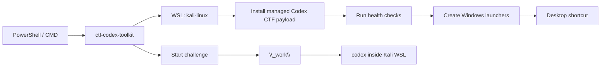

# CTF Codex Toolkit

[](https://www.npmjs.com/package/ctf-codex-toolkit)
[](https://github.com/nimosocute/ctf-codex-toolkit/actions/workflows/ci.yml)
[](LICENSE)
[](package.json)

CTF-focused Codex setup for Windows + Kali WSL.

`ctf-codex-toolkit` installs a managed Codex CTF environment: skills, checklists, snippets, guard hooks, health checks, optional browser automation helpers, and Windows launchers for per-challenge workspaces.

The toolkit is designed for this workflow:

```text
Windows terminal
  -> npm package command
  -> Kali WSL installer
  -> ~/.codex CTF payload
  -> ctf-codex <challenge>
  -> isolated workspace at <ctf-root>\_work\<challenge>
```

## Table of Contents

- [What This Project Provides](#what-this-project-provides)
- [Install](#install)
- [Requirements](#requirements)
- [How It Works](#how-it-works)
- [Command Reference](#command-reference)
- [Installed Files](#installed-files)
- [Workspace Model](#workspace-model)
- [Skill Credits and Updates](#skill-credits-and-updates)
- [Browser Arm](#browser-arm)
- [Health Checks](#health-checks)
- [Safety Model](#safety-model)
- [Supply Chain Notes](#supply-chain-notes)
- [Contributing](#contributing)
- [License](#license)

## What This Project Provides

This repository packages the operational pieces needed to run Codex as a CTF assistant inside Kali WSL while launching it comfortably from Windows.

| Area | Included |
| --- | --- |
| Codex CTF policy | Managed `AGENTS.md`, category routing, workflow guidance |
| Skills | Web, pwn, crypto, reverse, forensics, OSINT, malware, AI/ML, misc, solve dispatcher, writeup |
| Guard hooks | Pre-tool checks for broad scans, high-risk commands, and oversized candidate loops |
| Health checks | One-shot environment inventory for CTF tools, providers, Browser Arm, hooks |
| Browser support | Optional isolated Browser Arm venv using pinned `cloakbrowser==0.3.31` |
| Windows launchers | PowerShell/CMD launchers and a Desktop shortcut |
| Workspace layout | Per-challenge directories under a user-selected CTF root |

The package intentionally does not ship Codex provider configuration. Users keep their own official OpenAI Codex config or compatible third-party config outside this repository.

## Install

Run the setup command from PowerShell:

```powershell
npm exec --yes --package ctf-codex-toolkit -- ctf-codex-toolkit setup
```

For a pinned install:

```powershell
npm exec --yes --package ctf-codex-toolkit@0.1.0 -- ctf-codex-toolkit setup
```

Or install the CLI globally:

```powershell
npm install -g ctf-codex-toolkit
ctf-codex-toolkit setup
```

Start a challenge session:

```powershell
ctf-codex-toolkit my_challenge
```

Resume the last session for a challenge:

```powershell
ctf-codex-toolkit my_challenge -Resume
```

Install directly from GitHub when testing unreleased changes:

```powershell
npm exec --yes --package github:nimosocute/ctf-codex-toolkit -- ctf-codex-toolkit setup
```

## Requirements

- Windows with WSL2
- Kali WSL distro, default name `kali-linux`
- Node.js/npm on Windows
- Codex CLI installed inside Kali WSL and available as `codex`

Use a non-default WSL distro:

```powershell
ctf-codex-toolkit setup --distro kali-linux
ctf-codex-toolkit my_challenge --distro kali-linux
```

Use a non-default CTF root:

```powershell
ctf-codex-toolkit setup --ctf-root C:\CTF
ctf-codex-toolkit my_challenge --ctf-root C:\CTF
```

During `setup` or `install`, the CLI asks where to place the Windows CTF workspace root and stores the answer in:

```text
%USERPROFILE%\.ctf-codex-toolkit.json
```

Press Enter to use:

```text
%USERPROFILE%\ctf-workspaces
```

The launcher also honors:

- `CTF_CODEX_WSL_DISTRO`
- `CTF_CODEX_ROOT`
- `CTF_ROOT`
- `CODEX_BIN`

Explicit CLI flags take precedence over environment variables and saved config.

## How It Works



Setup performs three jobs:

1. Copy the managed payload into Kali WSL.
2. Prepare optional helper environments, including Browser Arm unless skipped.
3. Create Windows launchers and a Desktop shortcut for repeated use.

After setup, challenge sessions run under:

```text
<ctf-root>\_work\<challenge>
```

## Command Reference

```text
ctf-codex-toolkit setup [--distro kali-linux] [--ctf-root <path>] [--no-browser-arm] [--skip-health]
ctf-codex-toolkit install [--distro kali-linux] [--ctf-root <path>] [--no-browser-arm]
ctf-codex-toolkit health [--distro kali-linux]
ctf-codex-toolkit update-skills [--distro kali-linux] [--source https://github.com/ljagiello/ctf-skills.git]
ctf-codex-toolkit install-launchers
ctf-codex-toolkit <challenge> [-Resume] [--distro kali-linux] [--ctf-root <path>]
```

Compatibility aliases:

```text
ctf-codex-workflow
ctf-codex-wsl
ctf-codex
```

`setup` is the usual entry point. It runs `install` and then `health`.

Use `--skip-health` when optional tools are not installed yet:

```powershell
ctf-codex-toolkit setup --skip-health
```

Use `--no-browser-arm` to skip Browser Arm entirely:

```powershell
ctf-codex-toolkit setup --no-browser-arm
```

## Installed Files

Inside Kali WSL, `install` writes:

```text
~/.codex/AGENTS.md
~/.codex/ctf-checklists.md
~/.codex/ctf-snippets/
~/.codex/skills/ctf-*
~/.codex/skills/solve-challenge
~/.codex/skills/ctf-writeup
~/.codex/tools/ctf_health_check.py
~/.codex/tools/browser_arm/browser_server.py
/opt/codex-ctf-hooks/*
/usr/local/bin/ctf-codex
```

On Windows, it writes:

```text
%USERPROFILE%\ctf-codex-wsl.ps1
%USERPROFILE%\ctf-codex-wsl.cmd
Desktop\CTF Codex WSL.lnk
%USERPROFILE%\.ctf-codex-toolkit.json
```

The Desktop path is resolved through Windows APIs, so redirected Desktop folders such as OneDrive Desktop are supported.

The installer does not copy:

- `~/.codex/config.toml`
- provider keys
- API tokens
- sessions
- logs
- cookies
- `.env` files
- private keys
- runtime SQLite state

## Workspace Model

The CTF root is selected during setup. A challenge named `web_login` creates or uses:

```text
<ctf-root>\_work\web_login
```

That directory becomes the working directory for Codex. The intent is to keep each challenge isolated enough for normal CTF work while still being easy to inspect from Windows.

Example:

```powershell
ctf-codex-toolkit web_login
ctf-codex-toolkit web_login -Resume
```

## Skill Credits and Updates

The bundled CTF skill directories are derived from [ljagiello/ctf-skills](https://github.com/ljagiello/ctf-skills.git). Credit for the upstream CTF skill content belongs to that project and its contributors.

This toolkit packages those skills with Windows/Kali WSL launchers, guard hooks, health checks, snippets, and CTF workflow files.

Automatic update from upstream:

```powershell
ctf-codex-toolkit update-skills
```

Automatic update from a fork or compatible repository:

```powershell
ctf-codex-toolkit update-skills --source https://github.com/<owner>/<repo>.git
```

The updater runs inside Kali WSL, clones the source repository, finds skill directories containing `SKILL.md`, and refreshes matching CTF skill directories under:

```text
~/.codex/skills/
```

It updates directories named `ctf-*`, `solve-challenge`, and `ctf-writeup`. It does not delete unrelated user skills.

Manual update inside Kali WSL:

```bash
tmp="$(mktemp -d)"
git clone --depth 1 https://github.com/ljagiello/ctf-skills.git "$tmp/ctf-skills"
mkdir -p ~/.codex/skills
find "$tmp/ctf-skills" -mindepth 1 -maxdepth 3 -name SKILL.md -type f -print |
while read -r skill_file; do
  skill_dir="$(dirname "$skill_file")"
  name="$(basename "$skill_dir")"
  case "$name" in
    ctf-*|solve-challenge|ctf-writeup)
      rm -rf "$HOME/.codex/skills/$name"
      cp -a "$skill_dir" "$HOME/.codex/skills/$name"
      ;;
  esac
done
rm -rf "$tmp"
```

See [THIRD_PARTY_NOTICES.md](THIRD_PARTY_NOTICES.md).

## Browser Arm

By default, `setup` and `install` create an isolated venv at:

```text
~/.codex/tools/browser_arm/.venv
```

and install:

```text
cloakbrowser==0.3.31
```

CloakBrowser is a MIT-licensed browser automation project from [CloakHQ/CloakBrowser](https://github.com/CloakHQ/CloakBrowser). This toolkit uses it only for optional Browser Arm workflows: JavaScript execution, DOM inspection, storage inspection, console logs, and network logs during CTF web challenges.

CloakBrowser is installed inside the isolated Browser Arm venv, not globally. On first use, CloakBrowser may download and cache its Chromium binary.

Skip this dependency:

```powershell
ctf-codex-toolkit setup --no-browser-arm
```

## Health Checks

Run:

```powershell
ctf-codex-toolkit health
```

The health check verifies the installed CTF payload, selected tools, provider readiness signals, Browser Arm files, and hook availability. It is meant to catch broken or inconsistent setup state quickly after installation.

## Safety Model

The pre-tool guard blocks high-risk automated attack commands and broad candidate searches while allowing small deterministic loops.

This is defense-in-depth for common mistakes. It is not a sandbox, not a security boundary, and not a substitute for running Codex inside a scoped CTF workspace.

Current regression checks include:

- `range(1<<20)` blocked
- `range(10**8)` blocked
- `range(100000000)` blocked
- `range(2**20)` blocked
- `range(2**10)` allowed
- small shell `for` loops allowed
- `hashcat` blocked

## Supply Chain Notes

Prefer the published npm package for normal installation:

```powershell
npm exec --yes --package ctf-codex-toolkit@0.1.0 -- ctf-codex-toolkit setup
```

The GitHub install form executes repository content directly:

```powershell
npm exec --yes --package github:nimosocute/ctf-codex-toolkit -- ctf-codex-toolkit setup
```

For shared or sensitive environments:

- Review the repository before running setup.
- Pin npm versions, Git tags, or Git commits where practical.
- Prefer the npm package over mutable GitHub branch installs.
- Run `npm run smoke` when modifying the package locally.

CI runs `npm run smoke` and `npm pack --dry-run` on pushes and pull requests.

## Contributing

Contributor and release notes live in [CONTRIBUTING.md](CONTRIBUTING.md).

Development checks:

```powershell
npm run smoke
npm pack --dry-run
```

## License

[MIT](LICENSE)
