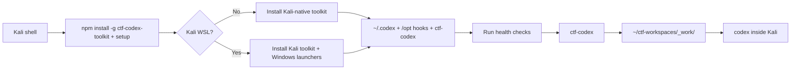
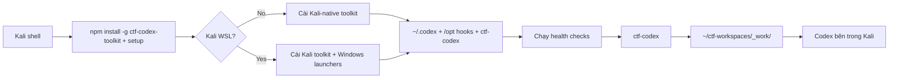

# CTF Codex Toolkit

[](https://www.npmjs.com/package/ctf-codex-toolkit)
[](https://github.com/nimosocute/ctf-codex-toolkit/actions/workflows/ci.yml)
[](LICENSE)
[](package.json)

[English](#english) | [Tiếng Việt](#tieng-viet)

## English

CTF-focused Codex setup for Kali Linux and Kali WSL.

`ctf-codex-toolkit` is installed from a Kali shell, either on native Kali or inside Kali WSL. The installer auto-detects the environment:

- Kali native: installs the Linux-side Codex CTF toolkit only.
- Kali WSL: installs the same Kali-side toolkit and also restores the Windows launcher/shortcut workflow.

It installs the managed Codex CTF environment into Kali: skills, checklists, snippets, guard hooks, health checks, the required CTF tool inventory, optional browser automation helpers, and per-challenge launchers.

The intended workflow is:

```text
Kali shell
  -> npm config set prefix ~/.npm-global
  -> npm install -g ctf-codex-toolkit
  -> ctf-codex-toolkit setup
  -> auto-detect Kali native vs Kali WSL
  -> ~/.codex CTF payload
  -> required CTF tools from tools_inventory.md
  -> /opt/codex-ctf-hooks guard hooks
  -> WSL only: Windows launcher + Desktop shortcut
  -> ctf-codex <challenge>
  -> ~/ctf-workspaces/_work/<challenge>
  -> codex inside Kali
```

## Table of Contents

- [What This Project Provides](#what-this-project-provides)
- [Install](#install)
- [Daily Usage](#daily-usage)
- [Requirements](#requirements)
- [How It Works](#how-it-works)
- [Command Reference](#command-reference)
- [Installed Files](#installed-files)
- [Workspace Model](#workspace-model)
- [Skill Credits and Updates](#skill-credits-and-updates)
- [Browser Arm](#browser-arm)
- [Health Checks](#health-checks)
- [Safety Model](#safety-model)
- [Supply Chain Notes](#supply-chain-notes)
- [Contributing](#contributing)
- [License](#license)

## What This Project Provides

This repository packages the operational pieces needed to run Codex as a CTF assistant inside Kali.

| Area | Included |
| --- | --- |
| Codex CTF policy | Managed `AGENTS.md`, category routing, workflow guidance |
| Skills | Web, pwn, crypto, reverse, forensics, OSINT, malware, AI/ML, misc, solve dispatcher, writeup |
| Guard hooks | Pre-tool checks for broad scans, high-risk commands, and oversized candidate loops |
| Health checks | One-shot environment inventory for CTF tools, providers, Browser Arm, hooks |
| CTF tools | Required bootstrap for the tools listed in `tools_inventory.md` |
| Browser support | Optional isolated Browser Arm venv using pinned `cloakbrowser==0.3.31` |
| Launchers | `/usr/local/bin/ctf-codex <challenge>` for daily use; `ctf-codex-toolkit <challenge>` also works after a global npm install |
| WSL integration | When run inside Kali WSL, writes the Windows `.ps1`/`.cmd` launcher and Desktop shortcut |
| Workspace layout | Per-challenge directories under a user-selected CTF root |

The package intentionally does not ship Codex provider configuration. Users keep their own official OpenAI Codex config or compatible third-party config outside this repository.

## Install

All commands below run inside Kali Linux or Kali WSL.

Install prerequisites if they are missing:

```bash
sudo apt update
sudo apt install -y nodejs npm python3 python3-venv git sudo
```

Verify Codex CLI is available inside Kali:

```bash
codex --version
```

Recommended for daily use: install the CLI globally inside Kali, then run setup.

System-wide install with sudo:

```bash
sudo npm install -g ctf-codex-toolkit
ctf-codex-toolkit setup
```

As of `0.1.23`, the npm package no longer installs a `ctf-codex` binary directly. That name is owned by `ctf-codex-toolkit setup`, which overwrites the old `/usr/local/bin/ctf-codex` launcher every time setup runs.

If you prefer not to use sudo, use a user-owned npm prefix:

```bash
npm config set prefix ~/.npm-global
mkdir -p ~/.npm-global/bin
grep -qxF 'export PATH="$HOME/.npm-global/bin:$PATH"' ~/.bashrc || echo 'export PATH="$HOME/.npm-global/bin:$PATH"' >> ~/.bashrc
export PATH="$HOME/.npm-global/bin:$PATH"
npm install -g ctf-codex-toolkit
ctf-codex-toolkit setup
```

The user-owned prefix avoids the common npm `EACCES` error caused by trying to write global packages into `/usr/local`.

If you already saw `EACCES`, run the same repair commands:

```bash
npm config set prefix ~/.npm-global
mkdir -p ~/.npm-global/bin
grep -qxF 'export PATH="$HOME/.npm-global/bin:$PATH"' ~/.bashrc || echo 'export PATH="$HOME/.npm-global/bin:$PATH"' >> ~/.bashrc
export PATH="$HOME/.npm-global/bin:$PATH"
npm install -g ctf-codex-toolkit
ctf-codex-toolkit setup
```

For a pinned global install:

```bash
npm config set prefix ~/.npm-global
export PATH="$HOME/.npm-global/bin:$PATH"
npm install -g ctf-codex-toolkit@0.1.23
ctf-codex-toolkit setup
```

One-shot setup without a global install also works, but management commands must be run through `npm exec` again:

```bash
npm exec --yes --package ctf-codex-toolkit@latest -- ctf-codex-toolkit setup
```

Start a challenge session after setup:

```bash
ctf-codex <challenge>
```

Resume the last session for a challenge:

```bash
ctf-codex <challenge> -Resume
```

If you installed globally, this also works:

```bash
ctf-codex-toolkit <challenge>
```

Install directly from GitHub when testing unreleased changes:

```bash
npm exec --yes --package github:nimosocute/ctf-codex-toolkit -- ctf-codex-toolkit setup
```

## Daily Usage

On Kali WSL, use the Windows shortcut created by setup:

```text
Desktop\CTF Codex WSL.lnk
```

When prompted, type a challenge name such as:

```text
bachdeptrai
```

The launcher finds or creates:

```text
<ctf-root>/_work/bachdeptrai
```

It then starts Codex inside that workspace. To continue an earlier Codex conversation, use Codex's built-in command inside the Codex session:

```text
/resume
```

On native Kali, the equivalent command is:

```bash
ctf-codex bachdeptrai
```

To update the Kali payload and Windows shortcut later:

```bash
npm exec --yes --package ctf-codex-toolkit@latest -- ctf-codex-toolkit setup --skip-health --skip-tools
```

## Requirements

- Kali Linux or Kali WSL
- Node.js/npm inside Kali
- Python 3 and `python3-venv`
- Git
- `sudo` for installing `/opt/codex-ctf-hooks/*` and `/usr/local/bin/ctf-codex`
- Codex CLI installed inside Kali and available as `codex`

This package does not install Kali Linux, WSL, or Codex CLI. It configures an existing Kali environment for CTF-focused Codex workflows.

When setup is run inside Kali WSL and Windows interop is available, it also writes:

```text
%USERPROFILE%\ctf-codex-wsl.ps1
%USERPROFILE%\ctf-codex-wsl.cmd
Desktop\CTF Codex WSL.lnk
```

Kali native installs skip those Windows files automatically.

Use a non-default CTF root:

```bash
npm exec --yes --package ctf-codex-toolkit@latest -- ctf-codex-toolkit setup --ctf-root ~/ctf
ctf-codex <challenge> --ctf-root ~/ctf
```

During `setup` or `install`, the CLI asks where to place the CTF workspace root and stores the answer in:

```text
~/.ctf-codex-toolkit.json
```

Press Enter to use:

```text
~/ctf-workspaces
```

The launcher also honors:

- `CTF_CODEX_ROOT`
- `CTF_ROOT`
- `CODEX_BIN`

Explicit CLI flags take precedence over environment variables and saved config.

## How It Works



Setup performs five jobs:

1. Copy the managed payload into `~/.codex`.
2. Install guard hooks and the `ctf-codex` launcher locally in Kali.
3. Install and verify the CTF tools mapped from `tools_inventory.md`, unless skipped.
4. Prepare optional helper environments, including Browser Arm unless skipped.
5. In Kali WSL only, install the Windows launcher files and Desktop shortcut.

The tool install is required by default. It uses Kali apt first, then fallback installers for inventory tools that are commonly absent from minimal Kali:

- `/opt/codex-ctf-python` venv for Python CTF libraries when apt packages are missing.
- `/opt/oss-cad-suite` for `yosys` and `bitwuzla`.
- `/opt/codex-ctf-sage` via micromamba for SageMath if apt does not provide `sage`.
- Go fallback for `ffuf` if the apt package is unavailable.
- Chromium runtime libraries plus the isolated Browser Arm venv for `cloakbrowser==0.3.31`.

After bootstrap, setup runs the health check. If any inventory tool is still missing, setup exits with a real error instead of reporting a clean install.

After setup, challenge sessions run under:

```text
<ctf-root>/_work/<challenge>
```

## Command Reference

Global install inside Kali is recommended for regular use, because it makes all `ctf-codex-toolkit ...` management commands available directly. If you used one-shot `npm exec`, run management commands through `npm exec` again. The installed daily challenge launcher is always `ctf-codex`.

```text
ctf-codex-toolkit --help
ctf-codex-toolkit -h
ctf-codex-toolkit --version
ctf-codex-toolkit version
ctf-codex-toolkit setup [--ctf-root <path>] [--no-browser-arm] [--skip-tools] [--skip-health]
ctf-codex-toolkit install [--ctf-root <path>] [--no-browser-arm] [--skip-tools]
ctf-codex-toolkit install-tools
ctf-codex-toolkit health
ctf-codex-toolkit update-skills [--source https://github.com/ljagiello/ctf-skills.git]
ctf-codex-toolkit install-launchers
ctf-codex --help
ctf-codex <challenge> [-Resume] [--ctf-root <path>]
ctf-codex-toolkit <challenge> [-Resume] [--ctf-root <path>]  # only if globally installed
ctf-codex-workflow <command-or-challenge> [options]
ctf-codex-wsl <command-or-challenge> [options]
```

Example without a global install:

```bash
npm exec --yes --package ctf-codex-toolkit@latest -- ctf-codex-toolkit health
```

Compatibility aliases:

```text
ctf-codex-workflow
ctf-codex-wsl
```

`ctf-codex` is the daily launcher installed by `ctf-codex-toolkit setup`; it is not an npm bin alias.

`setup` is the usual entry point. It runs `install` and then `health`.

Use `--skip-health` when optional tools are not installed yet:

```bash
ctf-codex-toolkit setup --skip-health
```

Use `--skip-tools` to install only the Codex payload, hooks, launchers, and optional Browser Arm without installing the full CTF inventory:

```bash
ctf-codex-toolkit setup --skip-tools
```

Install or repair only the tool inventory later:

```bash
ctf-codex-toolkit install-tools
```

Use `--no-browser-arm` to skip Browser Arm entirely:

```bash
ctf-codex-toolkit setup --no-browser-arm
```

Use `install-launchers` inside Kali WSL to recreate only the Windows launcher files and Desktop shortcut:

```bash
ctf-codex-toolkit install-launchers
```

When the Windows shortcut is launched from Kali WSL, it checks the published npm `latest` version. If a newer toolkit version is available, the launcher prompts:

```text
Update available! <current> -> <latest>

> 1. Update now
  2. Skip
  3. Skip until next version
```

Choosing update refreshes the toolkit payload, launchers, and saved toolkit version in Kali WSL, then continues launching the challenge. It skips the full CTF tool inventory install; run `ctf-codex-toolkit install-tools` when you want to repair or reinstall tools. The Windows launcher has its own embedded `LauncherVersion`, so stale shortcut files are detected even if the WSL config already contains a newer toolkit version.

If Codex fails before opening, the Windows launcher keeps the console open and prints the WSL exit code. Common causes are Codex CLI not installed inside Kali, `codex` missing from the WSL `PATH`, or a bad WSL distro name.

## Installed Files

Inside Kali, `install` writes:

```text
~/.codex/AGENTS.md
~/.codex/ctf-checklists.md
~/.codex/ctf-snippets/
~/.codex/skills/ctf-*
~/.codex/skills/solve-challenge
~/.codex/skills/ctf-writeup
~/.codex/tools/ctf_health_check.py
~/.codex/tools/browser_arm/browser_server.py
~/.codex/tools/browser_arm/browser_client.py
~/.ctf-codex-toolkit.json
/opt/codex-ctf-hooks/*
/usr/local/bin/ctf-codex
```

Inside Kali WSL only, setup also writes Windows-side launcher files through Windows interop:

```text
%USERPROFILE%\ctf-codex-wsl.ps1
%USERPROFILE%\ctf-codex-wsl.cmd
Desktop\CTF Codex WSL.lnk
```

The installer does not copy:

- `~/.codex/config.toml`
- provider keys
- API tokens
- sessions
- logs
- cookies
- `.env` files
- private keys
- runtime SQLite state

The installer writes hook executables under `/opt/codex-ctf-hooks` and symlinks them into `~/.codex/hooks`. It intentionally does not rewrite `~/.codex/config.toml`, because provider and runtime config is user-owned. Verify that your Codex runtime loads hooks from `~/.codex/hooks`; if your Codex build requires explicit hook registration in `config.toml`, register:

```text
/opt/codex-ctf-hooks/ctf_pre_tool_guard.py
/opt/codex-ctf-hooks/ctf_post_tool_guard.py
/opt/codex-ctf-hooks/ctf_stop_guard.py
```

## Workspace Model

The CTF root is selected during setup. A challenge named `web_login` creates or uses:

```text
~/ctf-workspaces/_work/web_login
```

That directory becomes the working directory for Codex.

Example:

```bash
ctf-codex <challenge>
ctf-codex <challenge> -Resume
```

## Skill Credits and Updates

The bundled CTF skill directories are derived from [ljagiello/ctf-skills](https://github.com/ljagiello/ctf-skills.git). Credit for the upstream CTF skill content belongs to that project and its contributors.

This toolkit packages those skills with Kali launchers, guard hooks, health checks, snippets, and CTF workflow files.

Automatic update from upstream:

```bash
ctf-codex-toolkit update-skills
```

Automatic update from a fork or compatible repository:

```bash
ctf-codex-toolkit update-skills --source https://github.com/<owner>/<repo>.git
```

The updater runs inside Kali, clones the source repository, finds skill directories containing `SKILL.md`, and refreshes matching CTF skill directories under:

```text
~/.codex/skills/
```

It updates directories named `ctf-*`, `solve-challenge`, and `ctf-writeup`. It does not delete unrelated user skills.

Manual update inside Kali:

```bash
tmp="$(mktemp -d)"
git clone --depth 1 https://github.com/ljagiello/ctf-skills.git "$tmp/ctf-skills"
mkdir -p ~/.codex/skills
find "$tmp/ctf-skills" -mindepth 1 -maxdepth 3 -name SKILL.md -type f -print |
while read -r skill_file; do
  skill_dir="$(dirname "$skill_file")"
  name="$(basename "$skill_dir")"
  case "$name" in
    ctf-*|solve-challenge|ctf-writeup)
      rm -rf "$HOME/.codex/skills/$name"
      cp -a "$skill_dir" "$HOME/.codex/skills/$name"
      ;;
  esac
done
rm -rf "$tmp"
```

See [THIRD_PARTY_NOTICES.md](THIRD_PARTY_NOTICES.md).

## Browser Arm

By default, `setup` and `install` create an isolated venv at:

```text
~/.codex/tools/browser_arm/.venv
```

and install:

```text
cloakbrowser==0.3.31
```

CloakBrowser is a MIT-licensed browser automation project from [CloakHQ/CloakBrowser](https://github.com/CloakHQ/CloakBrowser). This toolkit uses it only for optional Browser Arm workflows: JavaScript execution, DOM inspection, storage inspection, console logs, and network logs during CTF web challenges.

CloakBrowser is installed inside the isolated Browser Arm venv, not globally. On first use, CloakBrowser may download and cache its Chromium binary.

The Browser Arm server binds to `127.0.0.1` and requires a local shared token. By default the server creates `.browser_token` in `BROWSER_WORKDIR` and the bundled client reads it automatically. You can also set `BROWSER_TOKEN` or `BROWSER_TOKEN_FILE` explicitly when starting both processes.

Minimal Kali installs may not include all Chromium shared libraries. If `ctf-codex-toolkit health` reports a Browser Arm error such as `libnspr4.so: cannot open shared object file`, install the browser runtime dependencies:

```bash
sudo apt install -y libnspr4 libnss3 libatk-bridge2.0-0 libgtk-3-0 libgbm1 libxkbcommon0
```

Skip this dependency:

```bash
ctf-codex-toolkit setup --no-browser-arm
```

## Health Checks

Run inside Kali:

```bash
ctf-codex-toolkit health
```

The health check verifies the installed CTF payload, selected tools, provider readiness signals, Browser Arm files, and hook availability. It is meant to catch broken or inconsistent setup state quickly after installation.

On minimal Kali, `setup` installs and verifies the inventory tools first, including pwn, reverse, forensics, web fuzzing, cracking, hardware helpers, and Chromium runtime libraries used by Browser Arm. Large packages such as `sagemath`, `ghidra`, `python3-angr`, and oss-cad-suite may take time and disk space.

## Safety Model

The pre-tool guard blocks high-risk automated attack commands and broad candidate searches while allowing small deterministic loops. Path containment checks canonicalize paths before comparison, so `..` traversal through patch/edit/write targets is rejected before tools run.

This is defense-in-depth for common mistakes. It is not a sandbox, not a security boundary, and not a substitute for running Codex inside a scoped CTF workspace. Static script scanning is best-effort: inline `python -c`/`node -e` payloads and script files are inspected, but code supplied through pipes or heredocs is not fully parsed before interpreter startup.

Current regression checks include:

- `range(1<<20)` blocked
- `range(10**8)` blocked
- `range(100000000)` blocked
- `range(2**20)` blocked
- `range(2**10)` allowed
- small shell `for` loops allowed
- `hashcat` blocked

## Supply Chain Notes

Prefer the published npm package for normal installation:

```bash
npm exec --yes --package ctf-codex-toolkit@0.1.23 -- ctf-codex-toolkit setup
```

The GitHub install form executes repository content directly:

```bash
npm exec --yes --package github:nimosocute/ctf-codex-toolkit -- ctf-codex-toolkit setup
```

For shared or sensitive environments:

- Review the repository before running setup.
- Pin npm versions, Git tags, or Git commits where practical.
- Prefer the npm package over mutable GitHub branch installs.
- Run `npm run smoke` when modifying the package locally.

CI runs `npm run smoke` and `npm pack --dry-run` on pushes and pull requests.

## Contributing

Contributor and release notes live in [CONTRIBUTING.md](CONTRIBUTING.md).

Development checks:

```bash
npm run smoke
npm pack --dry-run
```

## License

[MIT](LICENSE)

<a id="tieng-viet"></a>

## Tiếng Việt

`ctf-codex-toolkit` là bộ cài đặt Codex tập trung cho CTF trên Kali Linux và Kali WSL.

Toolkit được cài từ shell Kali, chạy được trên Kali native hoặc Kali WSL. Trình cài đặt tự nhận diện môi trường:

- Kali native: chỉ cài phần toolkit trong Linux/Kali.
- Kali WSL: cài cùng toolkit trong Kali và tạo thêm launcher/shortcut phía Windows.

Toolkit cài môi trường Codex CTF được quản lý vào Kali: skills, checklist, snippets, guard hooks, health checks, danh sách công cụ CTF cần thiết, Browser Arm tùy chọn, và launcher theo từng challenge.

Luồng sử dụng chính:

```text
Kali shell
  -> npm config set prefix ~/.npm-global
  -> npm install -g ctf-codex-toolkit
  -> ctf-codex-toolkit setup
  -> tự nhận diện Kali native hay Kali WSL
  -> ~/.codex CTF payload
  -> công cụ CTF từ tools_inventory.md
  -> /opt/codex-ctf-hooks guard hooks
  -> chỉ WSL: Windows launcher + Desktop shortcut
  -> nhập tên challenge
  -> ~/ctf-workspaces/_work/<challenge>
  -> Codex chạy bên trong Kali
```

### Mục lục

- [Toolkit cung cấp gì](#toolkit-cung-cap-gi)
- [Cài đặt](#cai-dat)
- [Sử dụng hằng ngày](#su-dung-hang-ngay)
- [Yêu cầu](#yeu-cau)
- [Cách hoạt động](#cach-hoat-dong)
- [Lệnh thường dùng](#lenh-thuong-dung)
- [File được cài](#file-duoc-cai)
- [Mô hình workspace](#mo-hinh-workspace)
- [Cập nhật skills](#cap-nhat-skills)
- [Browser Arm](#browser-arm-1)
- [Health checks](#health-checks-1)
- [Mô hình an toàn](#mo-hinh-an-toan)
- [Ghi chú supply chain](#ghi-chu-supply-chain)
- [Đóng góp](#dong-gop)
- [License](#license-1)

<a id="toolkit-cung-cap-gi"></a>

### Toolkit cung cấp gì

Repo này đóng gói các phần cần thiết để chạy Codex như một trợ lý CTF bên trong Kali.

| Nhóm | Nội dung |
| --- | --- |
| Chính sách Codex CTF | `AGENTS.md` được quản lý, định tuyến category, hướng dẫn workflow |
| Skills | Web, pwn, crypto, reverse, forensics, OSINT, malware, AI/ML, misc, solve dispatcher, writeup |
| Guard hooks | Kiểm tra trước khi chạy tool để chặn scan rộng, lệnh rủi ro cao, vòng lặp candidate quá lớn |
| Health checks | Kiểm tra nhanh payload, tools, provider readiness, Browser Arm, hooks |
| CTF tools | Bootstrap các tool trong `tools_inventory.md` |
| Browser support | Browser Arm tùy chọn, dùng venv riêng với `cloakbrowser==0.3.31` |
| Launchers | `/usr/local/bin/ctf-codex <challenge>` cho sử dụng hằng ngày; `ctf-codex-toolkit <challenge>` cũng dùng được nếu đã cài npm global |
| WSL integration | Khi chạy trong Kali WSL, tạo Windows `.ps1`/`.cmd` launcher và Desktop shortcut |
| Workspace layout | Mỗi challenge có thư mục riêng dưới CTF root |

Toolkit không kèm cấu hình provider của Codex. Người dùng giữ config OpenAI Codex hoặc config provider khác bên ngoài repo này.

<a id="cai-dat"></a>

### Cài đặt

Tất cả lệnh bên dưới chạy trong Kali Linux hoặc Kali WSL.

Cài dependency cơ bản nếu thiếu:

```bash
sudo apt update
sudo apt install -y nodejs npm python3 python3-venv git sudo
```

Kiểm tra Codex CLI có sẵn trong Kali:

```bash
codex --version
```

Cách khuyến nghị để dùng hằng ngày: cài CLI global bên trong Kali, rồi chạy setup.

Cài system-wide bằng sudo:

```bash
sudo npm install -g ctf-codex-toolkit
ctf-codex-toolkit setup
```

Từ `0.1.23`, npm package không còn cài trực tiếp binary `ctf-codex`. Tên đó thuộc về `ctf-codex-toolkit setup`, và setup sẽ ghi đè launcher cũ ở `/usr/local/bin/ctf-codex` mỗi lần chạy.

Nếu không muốn dùng sudo, dùng npm prefix nằm trong home của user:

```bash
npm config set prefix ~/.npm-global
mkdir -p ~/.npm-global/bin
grep -qxF 'export PATH="$HOME/.npm-global/bin:$PATH"' ~/.bashrc || echo 'export PATH="$HOME/.npm-global/bin:$PATH"' >> ~/.bashrc
export PATH="$HOME/.npm-global/bin:$PATH"
npm install -g ctf-codex-toolkit
ctf-codex-toolkit setup
```

Prefix trong home tránh lỗi npm `EACCES` thường gặp khi npm cố ghi global package vào `/usr/local`.

Nếu bạn đã gặp `EACCES`, chạy lại các lệnh sửa này:

```bash
npm config set prefix ~/.npm-global
mkdir -p ~/.npm-global/bin
grep -qxF 'export PATH="$HOME/.npm-global/bin:$PATH"' ~/.bashrc || echo 'export PATH="$HOME/.npm-global/bin:$PATH"' >> ~/.bashrc
export PATH="$HOME/.npm-global/bin:$PATH"
npm install -g ctf-codex-toolkit
ctf-codex-toolkit setup
```

Cài global theo version cố định:

```bash
npm config set prefix ~/.npm-global
export PATH="$HOME/.npm-global/bin:$PATH"
npm install -g ctf-codex-toolkit@0.1.23
ctf-codex-toolkit setup
```

Setup one-shot không cài global vẫn dùng được, nhưng các lệnh quản trị sau đó phải chạy lại qua `npm exec`:

```bash
npm exec --yes --package ctf-codex-toolkit@latest -- ctf-codex-toolkit setup
```

Mở một challenge sau khi setup:

```bash
ctf-codex <challenge>
```

Resume session cuối của challenge:

```bash
ctf-codex <challenge> -Resume
```

Nếu đã cài global, lệnh này cũng dùng được:

```bash
ctf-codex-toolkit <challenge>
```

Cài trực tiếp từ GitHub khi test thay đổi chưa release:

```bash
npm exec --yes --package github:nimosocute/ctf-codex-toolkit -- ctf-codex-toolkit setup
```

<a id="su-dung-hang-ngay"></a>

### Sử dụng hằng ngày

Trên Kali WSL, dùng shortcut Windows được tạo bởi setup:

```text
Desktop\CTF Codex WSL.lnk
```

Khi được hỏi, nhập tên bài, ví dụ:

```text
bachdeptrai
```

Launcher sẽ tìm hoặc tạo:

```text
<ctf-root>/_work/bachdeptrai
```

Sau đó launcher mở Codex ngay trong workspace đó. Nếu muốn quay lại đoạn chat trước trong Codex, dùng lệnh có sẵn của Codex trong phiên Codex:

```text
/resume
```

Trên Kali native, lệnh tương đương là:

```bash
ctf-codex bachdeptrai
```

Khi cần cập nhật payload Kali và Windows shortcut:

```bash
npm exec --yes --package ctf-codex-toolkit@latest -- ctf-codex-toolkit setup --skip-health --skip-tools
```

<a id="yeu-cau"></a>

### Yêu cầu

- Kali Linux hoặc Kali WSL
- Node.js/npm trong Kali
- Python 3 và `python3-venv`
- Git
- `sudo` để cài `/opt/codex-ctf-hooks/*` và `/usr/local/bin/ctf-codex`
- Codex CLI đã cài trong Kali và gọi được bằng lệnh `codex`

Package này không cài Kali Linux, WSL, hoặc Codex CLI. Nó chỉ cấu hình môi trường Kali đã có để dùng Codex cho CTF.

Khi setup chạy trong Kali WSL và Windows interop hoạt động, nó cũng ghi:

```text
%USERPROFILE%\ctf-codex-wsl.ps1
%USERPROFILE%\ctf-codex-wsl.cmd
Desktop\CTF Codex WSL.lnk
```

Kali native sẽ bỏ qua các file Windows này.

Dùng CTF root khác mặc định:

```bash
npm exec --yes --package ctf-codex-toolkit@latest -- ctf-codex-toolkit setup --ctf-root ~/ctf
ctf-codex <challenge> --ctf-root ~/ctf
```

Trong lúc `setup` hoặc `install`, CLI hỏi nơi đặt CTF workspace root và lưu vào:

```text
~/.ctf-codex-toolkit.json
```

Nhấn Enter để dùng mặc định:

```text
~/ctf-workspaces
```

Launcher cũng đọc:

- `CTF_CODEX_ROOT`
- `CTF_ROOT`
- `CODEX_BIN`

CLI flags có độ ưu tiên cao hơn environment variables và config đã lưu.

<a id="cach-hoat-dong"></a>

### Cách hoạt động



Setup làm năm việc:

1. Copy payload được quản lý vào `~/.codex`.
2. Cài guard hooks và launcher `ctf-codex` trong Kali.
3. Cài và kiểm tra CTF tools trong `tools_inventory.md`, trừ khi bỏ qua.
4. Chuẩn bị helper environment tùy chọn, gồm Browser Arm nếu không tắt.
5. Chỉ trong Kali WSL, cài Windows launcher files và Desktop shortcut.

Mặc định setup sẽ cài tool inventory. Nó dùng apt của Kali trước, sau đó dùng fallback installer cho những tool hay thiếu trên Kali minimal:

- `/opt/codex-ctf-python` venv cho Python CTF libraries khi apt thiếu package.
- `/opt/oss-cad-suite` cho `yosys` và `bitwuzla`.
- `/opt/codex-ctf-sage` qua micromamba cho SageMath nếu apt không có `sage`.
- Go fallback cho `ffuf` nếu apt thiếu.
- Chromium runtime libraries và Browser Arm venv riêng cho `cloakbrowser==0.3.31`.

Sau bootstrap, setup chạy health check. Nếu tool inventory vẫn thiếu, setup sẽ báo lỗi thật thay vì báo cài thành công.

Sau setup, session challenge chạy dưới:

```text
<ctf-root>/_work/<challenge>
```

<a id="lenh-thuong-dung"></a>

### Lệnh thường dùng

Cài global trong Kali là cách khuyến nghị nếu dùng thường xuyên, vì mọi lệnh quản trị `ctf-codex-toolkit ...` sẽ gọi trực tiếp được. Nếu dùng one-shot `npm exec`, các lệnh quản trị cần chạy qua `npm exec` lại. Launcher mở bài hằng ngày luôn được cài là `ctf-codex`.

```text
ctf-codex-toolkit --help
ctf-codex-toolkit -h
ctf-codex-toolkit --version
ctf-codex-toolkit version
ctf-codex-toolkit setup [--ctf-root <path>] [--no-browser-arm] [--skip-tools] [--skip-health]
ctf-codex-toolkit install [--ctf-root <path>] [--no-browser-arm] [--skip-tools]
ctf-codex-toolkit install-tools
ctf-codex-toolkit health
ctf-codex-toolkit update-skills [--source https://github.com/ljagiello/ctf-skills.git]
ctf-codex-toolkit install-launchers
ctf-codex --help
ctf-codex <challenge> [-Resume] [--ctf-root <path>]
ctf-codex-toolkit <challenge> [-Resume] [--ctf-root <path>]  # chỉ khi đã cài global
ctf-codex-workflow <command-or-challenge> [options]
ctf-codex-wsl <command-or-challenge> [options]
```

Ví dụ không cài global:

```bash
npm exec --yes --package ctf-codex-toolkit@latest -- ctf-codex-toolkit health
```

Alias tương thích:

```text
ctf-codex-workflow
ctf-codex-wsl
```

`ctf-codex` là launcher dùng hằng ngày do `ctf-codex-toolkit setup` cài; nó không phải npm bin alias.

`setup` là entry point thông thường. Nó chạy `install` rồi chạy `health`.

Dùng `--skip-health` khi chưa muốn kiểm tra tool tùy chọn:

```bash
ctf-codex-toolkit setup --skip-health
```

Dùng `--skip-tools` để chỉ cài payload, hooks, launchers, và Browser Arm tùy chọn, không cài toàn bộ CTF inventory:

```bash
ctf-codex-toolkit setup --skip-tools
```

Cài hoặc sửa riêng tool inventory sau:

```bash
ctf-codex-toolkit install-tools
```

Bỏ qua Browser Arm hoàn toàn:

```bash
ctf-codex-toolkit setup --no-browser-arm
```

Trong Kali WSL, tạo lại riêng Windows launcher files và Desktop shortcut:

```bash
ctf-codex-toolkit install-launchers
```

Khi chạy Windows shortcut từ Kali WSL, launcher kiểm tra version `latest` trên npm. Nếu có bản mới hơn, nó hiện:

```text
Update available! <current> -> <latest>

> 1. Update now
  2. Skip
  3. Skip until next version
```

Chọn update sẽ cập nhật payload, launcher, và version đã lưu trong Kali WSL, rồi tiếp tục mở challenge. Nó bỏ qua cài lại full CTF inventory; dùng `ctf-codex-toolkit install-tools` khi muốn sửa hoặc cài lại tools. Windows launcher có `LauncherVersion` riêng, nên shortcut cũ vẫn bị phát hiện ngay cả khi config WSL đã ghi version toolkit mới hơn.

Nếu Codex không mở được, Windows launcher giữ console và in WSL exit code. Nguyên nhân thường gặp là Codex CLI chưa cài trong Kali, `codex` không có trong WSL `PATH`, hoặc sai tên WSL distro.

<a id="file-duoc-cai"></a>

### File được cài

Trong Kali, `install` ghi:

```text
~/.codex/AGENTS.md
~/.codex/ctf-checklists.md
~/.codex/ctf-snippets/
~/.codex/skills/ctf-*
~/.codex/skills/solve-challenge
~/.codex/skills/ctf-writeup
~/.codex/tools/ctf_health_check.py
~/.codex/tools/browser_arm/browser_server.py
~/.codex/tools/browser_arm/browser_client.py
~/.ctf-codex-toolkit.json
/opt/codex-ctf-hooks/*
/usr/local/bin/ctf-codex
```

Chỉ trong Kali WSL, setup cũng ghi file launcher phía Windows qua Windows interop:

```text
%USERPROFILE%\ctf-codex-wsl.ps1
%USERPROFILE%\ctf-codex-wsl.cmd
Desktop\CTF Codex WSL.lnk
```

Installer không copy:

- `~/.codex/config.toml`
- provider keys
- API tokens
- sessions
- logs
- cookies
- `.env` files
- private keys
- runtime SQLite state

Installer ghi hook executable vào `/opt/codex-ctf-hooks` và symlink vào `~/.codex/hooks`. Nó không tự sửa `~/.codex/config.toml` vì provider/runtime config thuộc về người dùng. Hãy kiểm tra Codex runtime của bạn có load hooks từ `~/.codex/hooks`; nếu bản Codex yêu cầu đăng ký hook rõ trong `config.toml`, đăng ký:

```text
/opt/codex-ctf-hooks/ctf_pre_tool_guard.py
/opt/codex-ctf-hooks/ctf_post_tool_guard.py
/opt/codex-ctf-hooks/ctf_stop_guard.py
```

<a id="mo-hinh-workspace"></a>

### Mô hình workspace

CTF root được chọn khi setup. Challenge tên `web_login` sẽ tạo hoặc dùng:

```text
~/ctf-workspaces/_work/web_login
```

Thư mục đó trở thành working directory cho Codex.

Ví dụ:

```bash
ctf-codex <challenge>
ctf-codex <challenge> -Resume
```

<a id="cap-nhat-skills"></a>

### Cập nhật skills

Các thư mục CTF skill được lấy từ [ljagiello/ctf-skills](https://github.com/ljagiello/ctf-skills.git). Credit nội dung CTF skill thuộc về project upstream và contributors của họ.

Toolkit này đóng gói các skills đó cùng Kali launchers, guard hooks, health checks, snippets, và CTF workflow files.

Cập nhật tự động từ upstream:

```bash
ctf-codex-toolkit update-skills
```

Cập nhật từ fork hoặc repo tương thích:

```bash
ctf-codex-toolkit update-skills --source https://github.com/<owner>/<repo>.git
```

Updater chạy trong Kali, clone source repository, tìm các thư mục skill có `SKILL.md`, rồi refresh các CTF skill tương ứng dưới:

```text
~/.codex/skills/
```

Nó cập nhật các thư mục tên `ctf-*`, `solve-challenge`, và `ctf-writeup`. Nó không xóa skill riêng không liên quan của người dùng.

Cập nhật thủ công trong Kali:

```bash
tmp="$(mktemp -d)"
git clone --depth 1 https://github.com/ljagiello/ctf-skills.git "$tmp/ctf-skills"
mkdir -p ~/.codex/skills
find "$tmp/ctf-skills" -mindepth 1 -maxdepth 3 -name SKILL.md -type f -print |
while read -r skill_file; do
  skill_dir="$(dirname "$skill_file")"
  name="$(basename "$skill_dir")"
  case "$name" in
    ctf-*|solve-challenge|ctf-writeup)
      rm -rf "$HOME/.codex/skills/$name"
      cp -a "$skill_dir" "$HOME/.codex/skills/$name"
      ;;
  esac
done
rm -rf "$tmp"
```

Xem thêm [THIRD_PARTY_NOTICES.md](THIRD_PARTY_NOTICES.md).

### Browser Arm

Mặc định, `setup` và `install` tạo venv riêng tại:

```text
~/.codex/tools/browser_arm/.venv
```

và cài:

```text
cloakbrowser==0.3.31
```

CloakBrowser là project browser automation license MIT từ [CloakHQ/CloakBrowser](https://github.com/CloakHQ/CloakBrowser). Toolkit chỉ dùng nó cho Browser Arm workflow tùy chọn: chạy JavaScript, xem DOM, xem storage, console logs, và network logs trong web CTF challenges.

CloakBrowser được cài trong Browser Arm venv riêng, không cài global. Lần dùng đầu tiên, CloakBrowser có thể tải và cache Chromium binary.

Browser Arm server bind `127.0.0.1` và yêu cầu local shared token. Mặc định server tạo `.browser_token` trong `BROWSER_WORKDIR` và client đi kèm tự đọc token đó. Bạn cũng có thể set `BROWSER_TOKEN` hoặc `BROWSER_TOKEN_FILE` khi start cả server và client.

Kali minimal có thể thiếu Chromium shared libraries. Nếu `ctf-codex-toolkit health` báo lỗi Browser Arm như `libnspr4.so: cannot open shared object file`, cài runtime dependencies:

```bash
sudo apt install -y libnspr4 libnss3 libatk-bridge2.0-0 libgtk-3-0 libgbm1 libxkbcommon0
```

Bỏ qua dependency này:

```bash
ctf-codex-toolkit setup --no-browser-arm
```

<a id="health-checks-1"></a>

### Health checks

Chạy trong Kali:

```bash
ctf-codex-toolkit health
```

Health check kiểm tra payload đã cài, selected tools, provider readiness signals, Browser Arm files, và hook availability. Nó giúp phát hiện setup bị thiếu hoặc lệch trạng thái ngay sau khi cài.

Trên Kali minimal, `setup` cài và kiểm tra inventory tools trước, gồm pwn, reverse, forensics, web fuzzing, cracking, hardware helpers, và Chromium runtime libraries dùng bởi Browser Arm. Các package lớn như `sagemath`, `ghidra`, `python3-angr`, và oss-cad-suite có thể tốn thời gian và dung lượng.

<a id="mo-hinh-an-toan"></a>

### Mô hình an toàn

Pre-tool guard chặn các lệnh automated attack rủi ro cao và broad candidate search, nhưng vẫn cho phép loop nhỏ có tính quyết định. Path containment được canonicalize trước khi so sánh, nên traversal kiểu `..` qua patch/edit/write bị chặn trước khi tool chạy.

Đây là defense-in-depth cho lỗi thao tác thường gặp. Nó không phải sandbox, không phải security boundary, và không thay thế việc chạy Codex trong workspace CTF đã scoped. Static script scanning là best-effort: inline `python -c`/`node -e` payload và script files được kiểm tra, nhưng code đưa qua pipe hoặc heredoc không được parse đầy đủ trước khi interpreter start.

Regression checks hiện có:

- `range(1<<20)` bị chặn
- `range(10**8)` bị chặn
- `range(100000000)` bị chặn
- `range(2**20)` bị chặn
- `range(2**10)` được cho phép
- shell `for` loop nhỏ được cho phép
- `hashcat` bị chặn

<a id="ghi-chu-supply-chain"></a>

### Ghi chú supply chain

Nên dùng package npm đã publish cho cài đặt thông thường:

```bash
npm exec --yes --package ctf-codex-toolkit@0.1.23 -- ctf-codex-toolkit setup
```

Dạng cài từ GitHub sẽ chạy trực tiếp nội dung repository:

```bash
npm exec --yes --package github:nimosocute/ctf-codex-toolkit -- ctf-codex-toolkit setup
```

Với môi trường shared hoặc nhạy cảm:

- Review repository trước khi chạy setup.
- Pin npm version, Git tag, hoặc Git commit khi có thể.
- Ưu tiên npm package thay vì GitHub branch mutable.
- Chạy `npm run smoke` khi sửa package local.

CI chạy `npm run smoke` và `npm pack --dry-run` trên push và pull request.

<a id="dong-gop"></a>

### Đóng góp

Contributor và release notes nằm trong [CONTRIBUTING.md](CONTRIBUTING.md).

Development checks:

```bash
npm run smoke
npm pack --dry-run
```

<a id="license-1"></a>

### License

[MIT](LICENSE)
